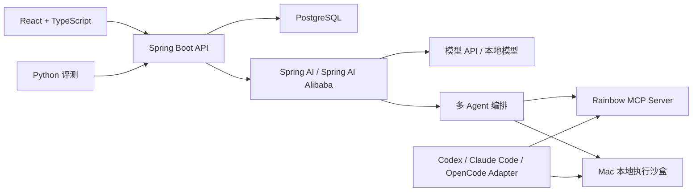
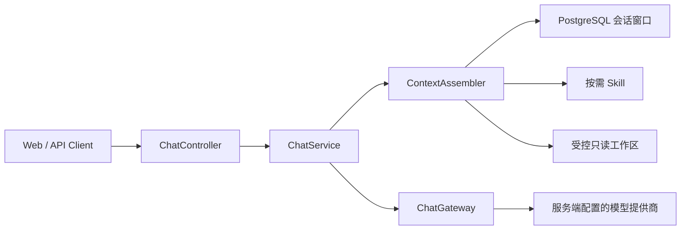

# 系统架构

最后更新：2026-09-04

## 总体架构

## 部署边界

### 阿里云

- Caddy：HTTPS、静态前端和反向代理。
- Spring Boot：业务、模型对话、上下文组装和只读 Agent 演示。
- PostgreSQL：项目、会话、消息、任务状态和审计数据。
- 不运行本地大模型，不开放任意命令执行。

### Mac

- 本地开发、构建、测试和压力测试。
- Ollama 或其他本地模型实验。
- Python 评测与框架对比。
- 临时 Docker 容器沙盒。
- Codex、Claude Code、OpenCode 本地适配器。

## 多 Agent

- Coordinator：规划、分派和汇总。
- Context Agent：按需读取项目文件、规则、历史摘要和工具结果。
- Code Analyst Agent：分析项目结构与代码。
- Diagnostic Agent：形成根因候选。
- Verifier Agent：检查证据和矛盾。
- Report Agent：生成最终报告。
- Executor Agent：唯一允许在审批后进入执行沙盒的 Agent。

## 沙盒

- 每次任务使用临时容器，结束后销毁。
- 默认无网络、非 root、只读根文件系统。
- 项目默认只读挂载；修改写入临时副本并返回 diff。
- 限制 CPU、内存、进程、磁盘、输出大小和执行时间。
- 不挂载 Docker Socket、SSH 目录、云凭据或用户主目录。

## 协议适配

内部统一 `CodingAgentAdapter` 与 Agent 事件模型。MCP 用于共享工具和上下文；Codex、Claude Code、OpenCode 各自保留独立的会话与权限适配器。能力无法映射时默认拒绝。

核心事件：文本增量、工具调用、工具结果、文件 diff、审批请求、用量、错误和完成。

## 当前流式对话边界

- 客户端请求接受 `message` 以及服务端生成的 `projectId`、`conversationId`、`skillId`；未知字段会被拒绝。
- 模型地址、API Key 和系统提示词只能由服务端配置提供，不进入请求体、日志或指标标签。
- SSE 事件固定为 `metadata`、`phase`、`token`、`done`、`error`；元数据包含会话、模型、Skill、上下文来源和裁剪状态。
- 模型网关支持 `native` 与 `buffered` 两种传输。xtoken 本地预览因上游原生流不稳定使用 buffered，再把完整响应按 Unicode code point 安全切片；协议层仍保持一致 SSE。
- 超时、客户端断开、完成和异常都会释放上游订阅；没有配置模型时以 `AI_NOT_CONFIGURED` 失败关闭。
- 项目、会话和消息持久化到 PostgreSQL；上下文使用最近 12 条消息的滑动窗口。摘要压缩、用户鉴权和多租户隔离尚未完成，因此不得作为公网多用户服务发布。
- 每次请求创建 `agent_runs`，依次记录 `CONTEXT`、`RESPOND` 与终态事件；固定 `iteration=1` 防止无界循环，客户端取消也写入终态。

## 当前上下文装配

`ContextAssembler` 在每次模型调用前组装：系统约束、显式流程、按需 Skill、最近会话、受控项目文件与当前请求。默认不做向量检索。工作区读取限制深度、文件数、单文件与总字符数，拒绝绝对路径和越界路径，并跳过 `.env`、密钥、Git、依赖与构建目录。

每轮装配通过 SSE 返回来源和裁剪标志，并把模型、Skill 与上下文数量写入消息元数据。后续仍需增加摘要版本、精确 Token 与过期策略。

## 只读 MCP

- `MCP_ENABLED=false` 为默认值，避免无鉴权 HTTP MCP 意外暴露。
- 本地显式启用后使用 Spring AI Streamable HTTP，并只注册 `listSkills` 与 `readProjectSnapshot`。
- MCP 文件读取复用同一 `WorkspaceReader`，不存在任意路径、任意 URL、SQL 或命令执行工具。

## 当前基础接口

- `POST /api/chat/stream`
- `GET /api/chat/status`
- `GET|POST /api/projects`
- `GET /api/conversations`
- `GET /api/conversations/{id}/messages`
- `GET /api/skills`
- `GET /api/runs/{id}`
- `GET /actuator/health`
