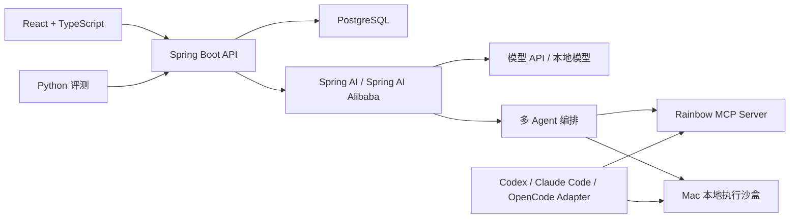
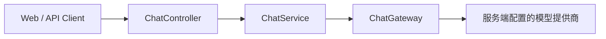

# 系统架构

最后更新：2026-09-04

## 总体架构

## 部署边界

### 阿里云

- Caddy：HTTPS、静态前端和反向代理。
- Spring Boot：业务、模型对话、上下文组装和只读 Agent 演示。
- PostgreSQL：项目、会话、消息、任务状态和审计数据。
- 不运行本地大模型，不开放任意命令执行。

### Mac

- 本地开发、构建、测试和压力测试。
- Ollama 或其他本地模型实验。
- Python 评测与框架对比。
- 临时 Docker 容器沙盒。
- Codex、Claude Code、OpenCode 本地适配器。

## 多 Agent

- Coordinator：规划、分派和汇总。
- Context Agent：按需读取项目文件、规则、历史摘要和工具结果。
- Code Analyst Agent：分析项目结构与代码。
- Diagnostic Agent：形成根因候选。
- Verifier Agent：检查证据和矛盾。
- Report Agent：生成最终报告。
- Executor Agent：唯一允许在审批后进入执行沙盒的 Agent。

## 沙盒

- 每次任务使用临时容器，结束后销毁。
- 默认无网络、非 root、只读根文件系统。
- 项目默认只读挂载；修改写入临时副本并返回 diff。
- 限制 CPU、内存、进程、磁盘、输出大小和执行时间。
- 不挂载 Docker Socket、SSH 目录、云凭据或用户主目录。

## 协议适配

内部统一 `CodingAgentAdapter` 与 Agent 事件模型。MCP 用于共享工具和上下文；Codex、Claude Code、OpenCode 各自保留独立的会话与权限适配器。能力无法映射时默认拒绝。

核心事件：文本增量、工具调用、工具结果、文件 diff、审批请求、用量、错误和完成。

## 当前流式对话边界

- 客户端请求只接受 `message`；未知字段会被拒绝。
- 模型地址、API Key 和系统提示词只能由服务端配置提供，不进入请求体、日志或指标标签。
- SSE 事件固定为 `metadata`、`token`、`done`、`error`，每次请求生成 `requestId` 以便排障。
- 超时、客户端断开、完成和异常都会释放上游订阅；没有配置模型时以 `AI_NOT_CONFIGURED` 失败关闭。
- 当前实现是无会话的单轮协议骨架，尚未提供用户鉴权、会话持久化、历史压缩和多租户隔离；这些能力完成前不得作为公网多用户对话服务发布。

## 规划中的上下文装配

`ContextAssembler` 在每次模型调用前按优先级组装：系统约束、当前目标、项目元数据、按需读取的文件片段、可用工具、会话摘要和 Token 预算。默认不做向量检索；先用目录清单、文件类型、关键词、调用轨迹和 Agent 主动读取获得上下文。

每轮装配记录来源、字符或 Token 估算、裁剪原因和关联 `requestId`。长内容保留文件位置与摘要，需要时再读取；过期会话状态必须可淘汰或压缩。

## 当前基础接口

- `POST /api/chat/stream`
- `GET /actuator/health`
